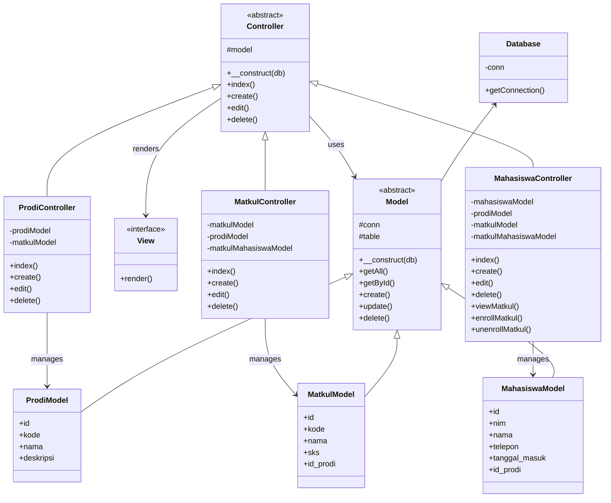

# TP8DPBO2025C1

# Janji
Saya Muhammad Ichsan Khairullah dengan NIM 2306924 mengerjakan Tugas Praktikum 8 dalam mata kuliah Desain dan Pemograman Berorientasi Objek untuk keberkahanNya maka saya tidak melakukan kecurangan seperti yang telah dispesifikasikan. Aamiin.

# Desain Program
Program ini menggunakan arsitektur MVC (Model-View-Controller) dengan struktur:

