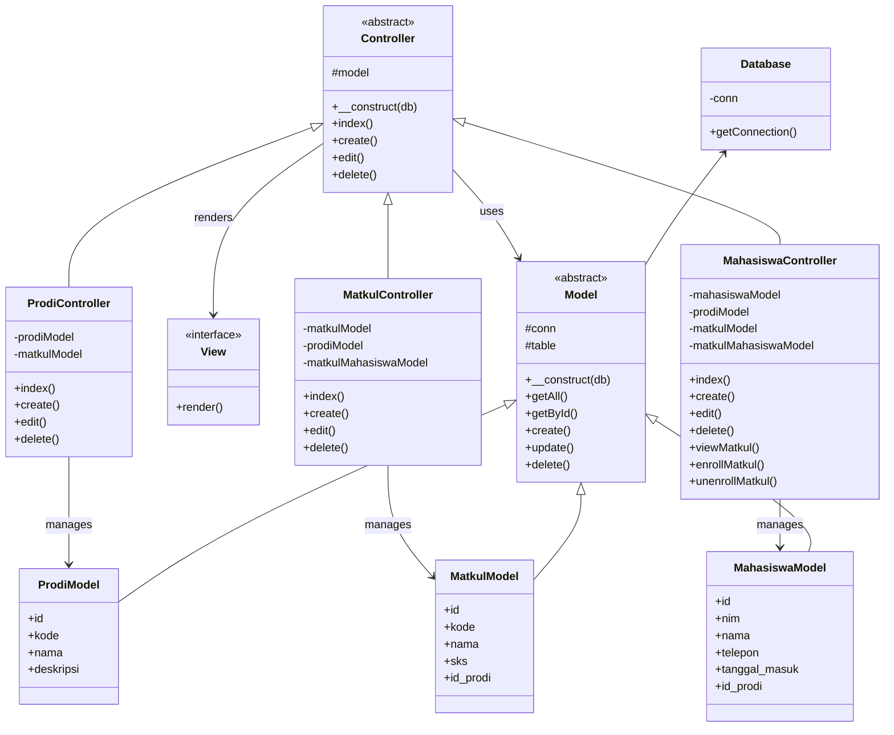
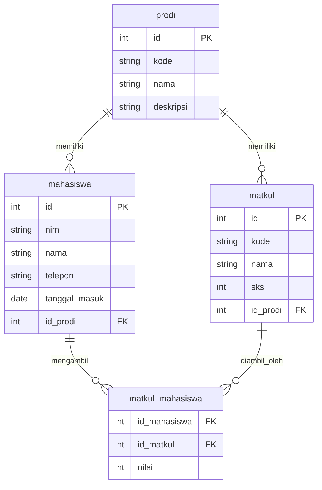
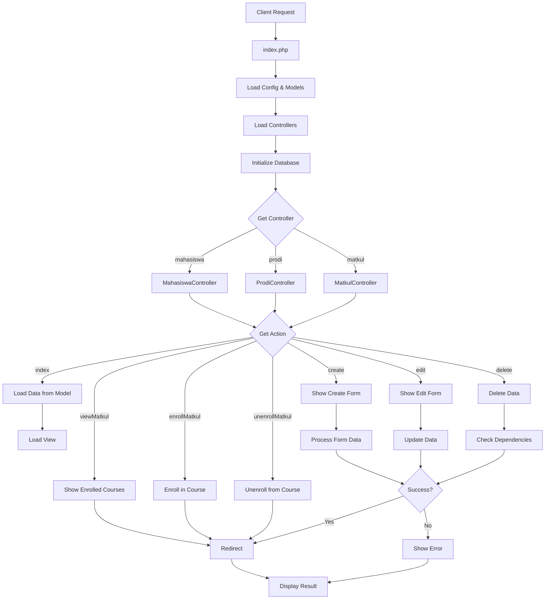

# TP8DPBO2025C1

# Janji
Saya Muhammad Ichsan Khairullah dengan NIM 2306924 mengerjakan Tugas Praktikum 8 dalam mata kuliah Desain dan Pemograman Berorientasi Objek untuk keberkahanNya maka saya tidak melakukan kecurangan seperti yang telah dispesifikasikan. Aamiin.

# Desain Program
Program ini menggunakan arsitektur MVC (Model-View-Controller) dengan struktur:

# Struktur Database

# Alur Program

# Fitur Utama & Relasi
1. Program Studi (Prodi)
- Entitas dasar yang dibutuhkan entitas lain
- Memiliki banyak Matkul dan Mahasiswa
- Tidak bisa dihapus jika masih ada Matkul terkait

2. Mata Kuliah (Matkul)
- Terhubung ke satu Prodi
- Bisa diambil oleh banyak Mahasiswa
- Tidak bisa dihapus jika masih ada mahasiswa yang mengambil

3. Mahasiswa
- Terdaftar di satu Prodi
- Bisa mengambil banyak Matkul
- Nilai disimpan di tabel matkul_mahasiswa

# Contoh Alur Request
Untuk request "lihat semua mahasiswa":
1. Browser akses index.php?controller=mahasiswa&action=index
2. index.php memuat file yang diperlukan dan membuat MahasiswaController
3. Memanggil method index() pada controller
4. Controller menggunakan MahasiswaModel untuk mengambil data
5. Data diteruskan ke view (views/mahasiswa/index.php)
6. View menampilkan HTML dengan data tersebut

# Fitur Keamanan
1. Database menggunakan PDO dengan prepared statements
2. Validasi input pada form
3. Constraint foreign key mencegah data yang tidak valid
4. Pengelolaan session untuk sistem autentikasi (jika diperlukan)

# Dokumentasi

